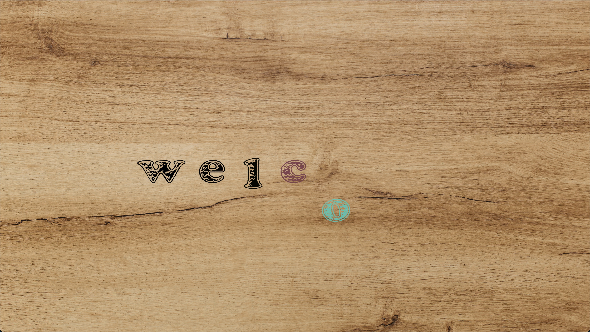
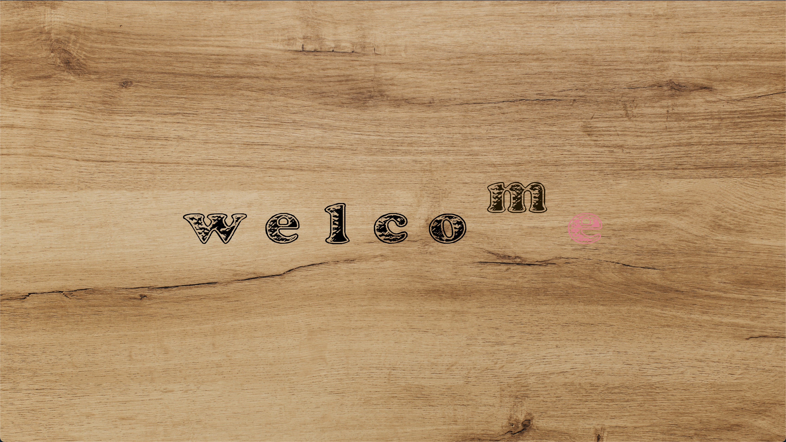
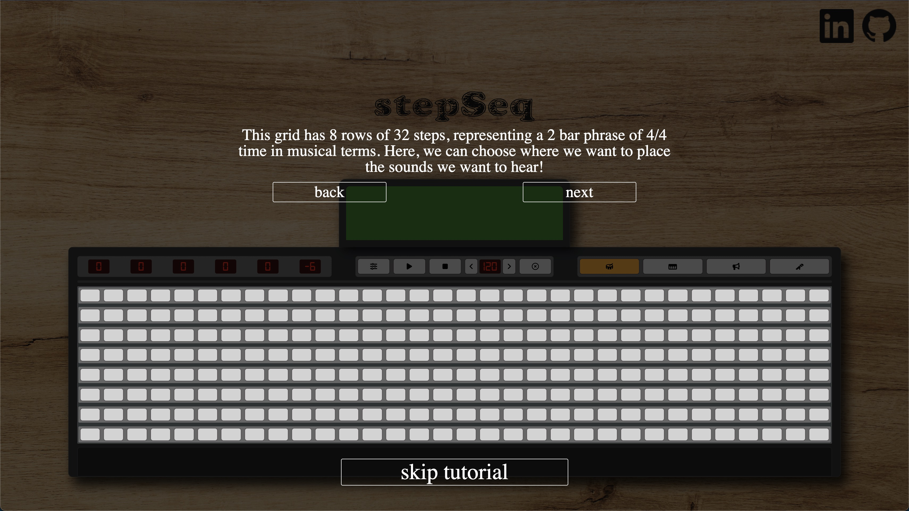
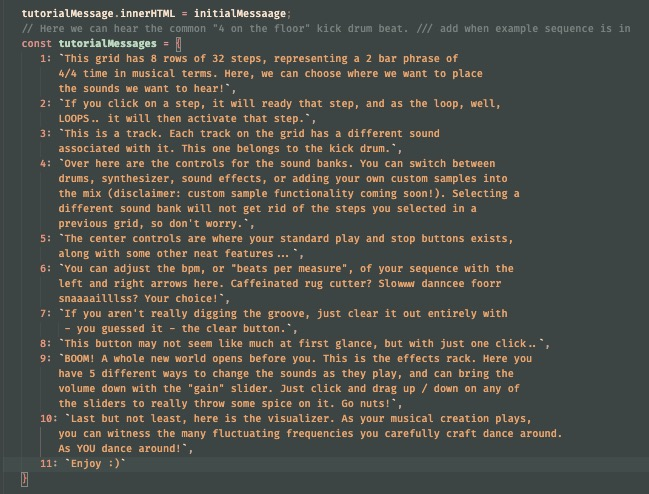
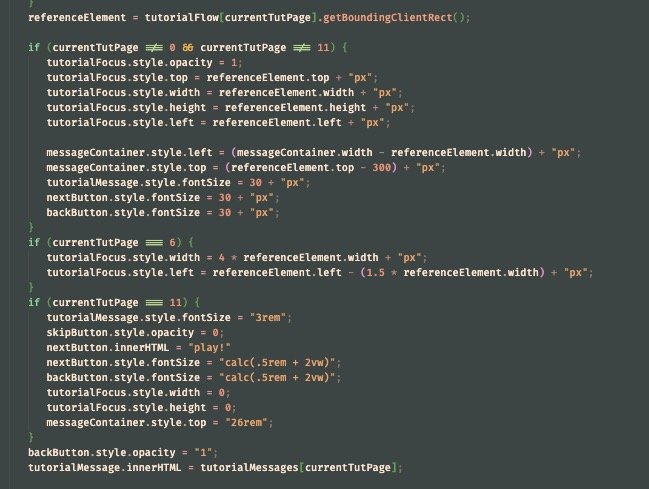
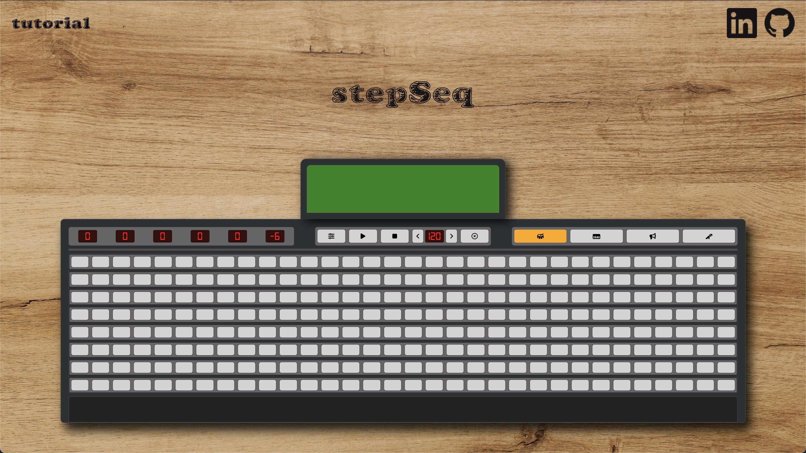
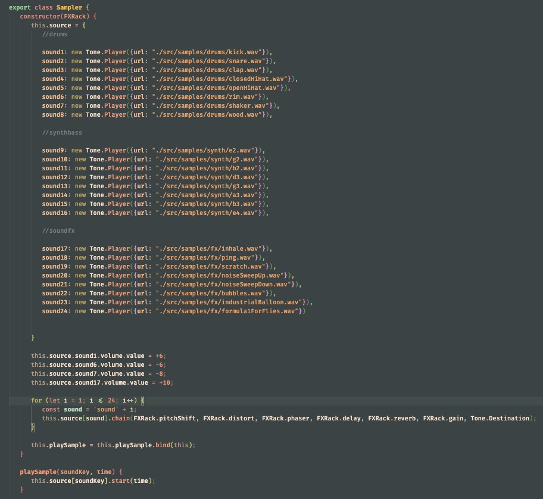

# *stepSeq*
A step sequencer with preset samples, effects, and custom sample loading

---------------------------------------------------------------------------------------

This is my first attempt at building a step sequencer that runs completely in the browser. It comes shipped with 3 different sound banks, each comprised of 8 sounds each. The user is able to arrange where they want the samples to play within a 32-step grid representing a 2 bar pattern, with one row per instrument and 4 steps per beat. This pattern plays, and after reaching the end, loops back again continuously.
The user can then change the sound of the audio dynamically using the different audio effect sliders included.

In the future, the user will be able to use their microphone to record their own samples, and then slice / stretch / rearrange these before placing them into the custom samples sound bank. I hope to also expand the functionality of the effects to be able to target individual tracks instead of just the sum output.

---------------------------------------------------------------------------------------

**In stepSeq, users will be able to:**

- Choose from an assortment of sound pallette presets
- Arrange instrument play patterns
- Dynamically change these patterns with effects as they loop
- Learn the device quickly from the interactive tutorial


**In addition, this project will include:**

- Style-dependent theme reskins
- Note-style selection for melodical instruments
- Record / load / loop / effect their own samples
- Individual track effects
- More functionality to come... :)

---------------------------------------------------------------------------------------

**Wireframe Mockup**


---------------------------------------------------------------------------------------

**Welcome Page**

The welcome page is designed to reflect the operation of the device, making for a more cohesive experience




---------------------------------------------------------------------------------------

**Tutorial Pages**

The tutorial layer is separate from the device layer, and in order to make the specific areas that were being discussed "light up", ```.getBoundingClientRect()``` was used to find the location of the currently discussed component, and a "highlighted" square with a large box-shadow was super-imposed over that 



This focus-square is dynamically positioned and given a custom message depending on where you are in the tutorial, and will line up correctly even upon a resize event




---------------------------------------------------------------------------------------

**The Sequencer**

Leaning towards slight realism for the actual device, the faders for the sliders are an edited vector image, and the sliders have been transformed 90 degrees counterclockwise. As the loop plays, each step within that column is given a white box-shadow to simulate the beat marker passing over it




---------------------------------------------------------------------------------------

**Building the Tracks**

Each "track" of the grid is comprised of a single ```Tone.Player``` instance inside of a ```Sampler``` object, which upon initiation has its audio signal routed through each of the FX modules into ```Tone.Destination```. As the beat marker passes over a step with a ```data-is-active``` attribute of "true", the id of the step is passed in to key into the correct audio sample and activate it




---------------------------------------------------------------------------------------

**Technologies**

- WebAudio API
- Canvas API
- Tone.js
- GIMP

---------------------------------------------------------------------------------------

**Implementation Timeline**

- 9/16/22 > finish wireframe mockup, learn / begin canvas page structure
- 9/17/22 > finish rough canvas, begin structuring logic
- 9/18/22 > build out basic looping and audio functions, create effects if time
- 9/19/22 > get started with browser "DB" and microphone recording
- 9/20/22 > start polishing and making sure all features are working, refactoring
- 9/21/22 > add css animations/transitions
- 9/22/22 > tie up any loose ends / finishing touches

